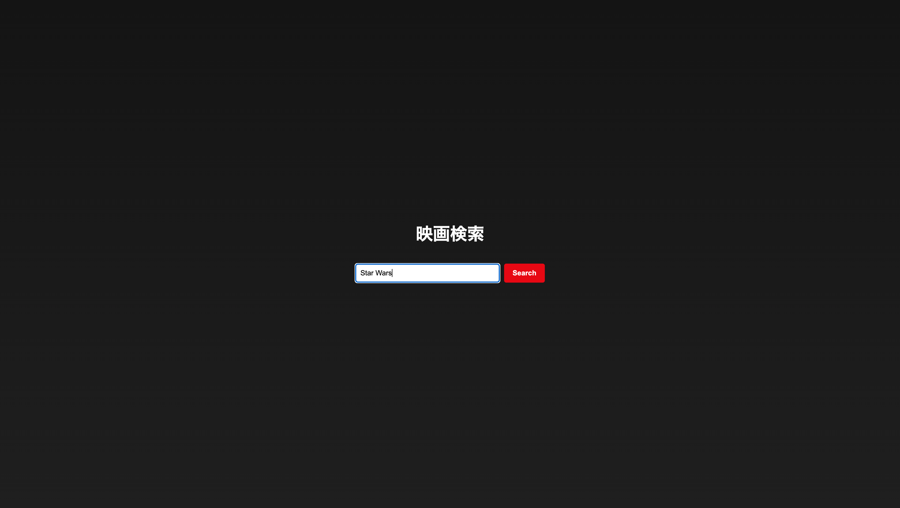

# React×TMDB 映画検索アプリ

TMDB APIを利用して映画情報を取得し、検索結果をReactで表示します。

---

## 完成イメージ

### 検索画面　


### 検索結果画面


---

## コード解説

```tsx
export default function App() {
  const [query, setQuery] = useState<string>("");
  const [movies, setMovies] = useState<Movie[]>([]);

  const searchMovies = async () => {
    try {
      const res = await axios.get<{ results: Movie[] }>(
        "https://api.themoviedb.org/3/search/movie",
        {
          params: {
            api_key: "YOUR_API_KEY_HERE",
            query,
            language: "en-US",
          },
        }
      );
      setMovies(res.data.results);
    } catch (error) {
      console.error("Search error:", error);
    }
  };
}
```
---

## 各コードの解説

### 1.入力値の状態管理
```tsx
const [query, setQuery] = useState<string>("");
```

・入力フォームの文字列を保持するstate。

・query : ユーザーが入力した映画タイトル。

・setQuery : queryを更新する関数。

・useState<string>("") : TypeScriptで型を文字列に指定、初期値は空文字。  

### 2.映画リストの状態管理
```tsx
const [movies, setMovies] = useState<Movie[]>([]);
```

・TMDB APIから取得した映画リストを保持するstate。

・movies : 映画データの配列。

・setMovies : moviesを更新する関数。

・型は Movie[]、初期値は空配列。

### 3.APIへのリクエストパラメータ
```tsx
params: {...}
```

・APIに渡すパラメータ

・api_key：自分のTMDB APIキー（必須）

・query：ユーザーの入力文字列

・language：取得するデータの言語（例: "en-US"）

 ### 4.検索結果の格納
```tsx
setMovies(res.data.results);
```

・APIから返ってきた結果をmoviesにセット。

・Reactが自動的に再レンダリング → 画面に映画リストが表示される。
 


